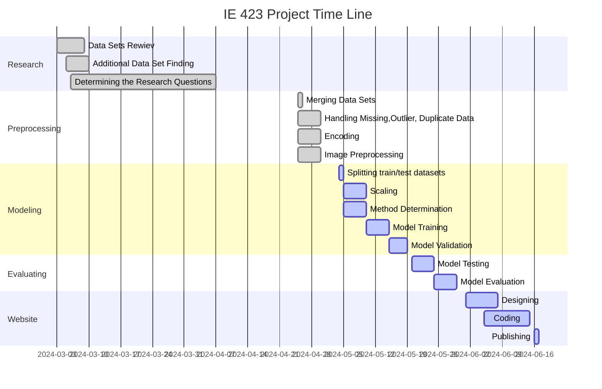

## *Director Prediction Based on the Film's Characteristics*

### *Principal Goals of the Project* 
The main purpose of the study is to estimate the director by taking into account various features of the films. 
When generating predictions, factors including the movies's genre, cast, release year, length, type, rating and description of the film taken into account. In addition to these characteristics, Bechdel test scores and movie posters are also utilized to predict the director.

## *Utilizing of the datasets*
First of all, two data sets contining Amazon Prime and Netflix movies and TV shows are used. These data sets provide details on the movie's titles, directors, casts, countries, and genres.

In addition, the data set containing Bechdel tests scores of movies is used. 

A separate data set is used to obtain the necessary information about the posters of the movies.

## *Preprocessing Steps*
### *Merging Data Sets*
Merging Netflix Movies and TV Shows & Amazon Prime Movies and TV Shows data sets, making sure that there are no duplicate data.

The dataset combined in the previous stage and the common data in the Movie Becdel Test Scores dataset were taken,approximately 1300 data were obtained. The process of finding common data was sone based on the "title" columns.

In the final merging stage of the datasets, the Movie Genre from its Poster dataset was utilized. At this stage, in order to process the data, a change had to be made in the "Title" column in this "Movie Genre from its Poster" dataset. Since the film names were found in dataset like "Toy Story(1995)", matching couldn't be achieved, and a new dataset containing seperated film names as "title" and years as "year" was created. 

Then, the process of finding the common datas was done with this new dataset.

### *Sources of Data Sets*
[Amazon Prime Movies and TV Shows](https://www.kaggle.com/datasets/shivamb/amazon-prime-movies-and-tv-shows)

[Netflix Movies and TV Shows](https://www.kaggle.com/datasets/shivamb/netflix-shows)

[Movie Bechdel Test Scores](https://www.kaggle.com/datasets/alisonyao/movie-bechdel-test-scores?select=Bechdel_detailed.csv)

[Movie Genre from its Poster](https://www.kaggle.com/datasets/neha1703/movie-genre-from-its-poster)

