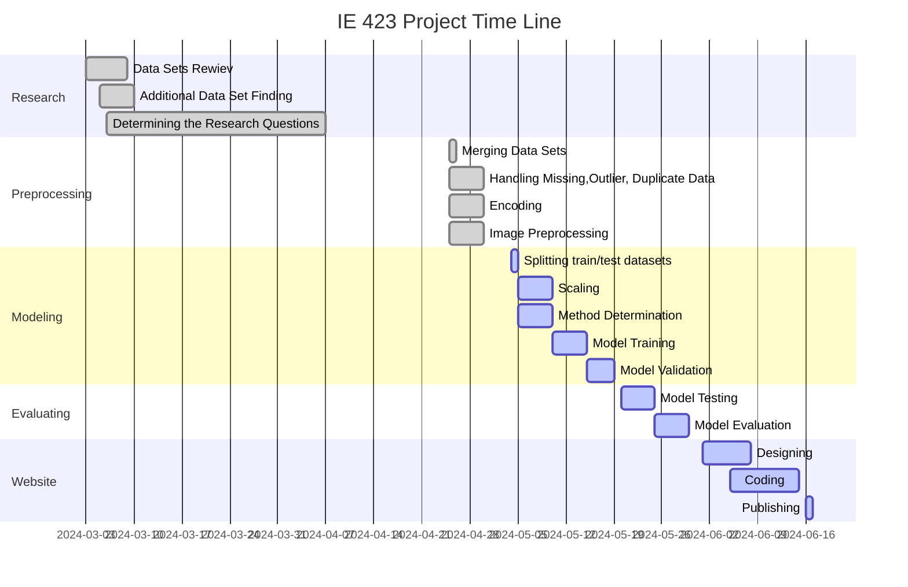

## *Director Prediction Based on the Film's Characteristics*

## *Principal Goals of the Project* 
The film industry is a complex environment where various factors influence the decisions behind movie production. One crucial aspect is the director, whose vision and style can impact the outcome of a film.The main purpose of the project is to predict the director by taking into account various features of the films. When generating predictions, factors including the movie's genre, cast, release year, length, type, rating, and description of the film are considered. In addition to these characteristics, Bechdel test scores and movie posters are also utilized to predict the director. These features have been considered to add new perspectives to predicting the film director.By incorporating a diverse range of features, the aim is to build a comprehensive model that can accurately predict the director of a given film.

## *Resarch Questions* 
- How accurately can we predict the director of a movie based on features such as cast, duration, genre, Bechdel score, IMDb score?
- What are the most significant factors influencing the choice of director for a movie?
- How does the performance of different machine learning algorithms compare in predicting movie directors based on film characteristics?

## *Utilizing of the datasets*
First of all, two data sets contining Amazon Prime and Netflix movies and TV shows are used. These data sets provide details on the movie's titles, directors, casts, countries, and genres.

In addition, the data set containing Bechdel tests scores of movies is used. 

A separate data set is used to obtain the necessary information about the posters of the movies.

## *Some of the Utilized Libraries*
The libraries pandas, numpy, seaborn, matplotlib, sklearn, sklearn, TensorFlow Keras, PIL, io,  have been used in this project. 

## *Preprocessing Steps*

### Detalied Explanation of Preprocessing Parts

Initially, URLs containing CSV files were fetched, read, and converted into dataframes. Subsequently, dataframe names were changed to more meaningful ones.
A for loop was then created to split the "Title" column and extract the year enclosed in parentheses. Additionally, "Title" entries, which start with a capital letter, were corrected to start with a lowercase "title".The dataframes netflix_df, prime_df, bechdel_df, and movieposter_df were merged. Null and duplicate data were regularly checked for and removed if any existed. The Netflix and Amazon datasets were merged based on the 'title' column, combining the datasets into one. Following this, three DataFrames were merged: merged_df and bechdel_df were merged based on the 'title' column into merged_bnp_df, and then merged_bnp_df and movieposter_df were merged based on the 'title' column into allmerged_df. Subsequently, the presence of duplicates in the merged data frame was checked. unwanted columns were removed from the dataset, such as 'show_id', 'date_added', 'imdbid', ', 'description',  'Imdb Link''year_y'.Then, the remaining columns were sorted in the desired order. Null data was initially examined, with 17 null values identified in the 'cast' column, 317 in the 'country' column, and 92 in the 'director' column. Following this assessment, subsequent operations were performed on the dataset. 

In the next step, the first three actors' names from each row in the 'cast' column were extracted and labeled as cast1, cast2, and cast3, while the original 'cast' column was removed. Any null values identified in the preceding steps were then removed.The code in one part splits each entry in the 'Genre' column using the '|' character and selects the first category. Similarly, it separates each entry in the 'country' column using the ',' character and picks the first country mentioned.Another part ensures that only the initial numerical value is retained within each entry of the 'duration' column. There's a section intended to identify duplicate data within the dataset, revealing 18 instances of duplicate data upon examination.And then, duplicate rows are removed from the 'cleaned_df' DataFrame. 

The following step in preprocessing involves checking for outliers.The 'Duration' column was examined for outliers, and the data points with a value equal to 1, namely [136, 169, 221, 229, 246, 247], were removed from the dataset. 

The function f.get_ydata was used. No outlier data was found for the Bechdel test, except for the 'Duration' column. As data dropping operations are performed, inconsistencies arise with the indices. Therefore, to prevent this, the index count is reset. 
### **RGB** 

Following this, for each movie in the 'no_outlier_df' DataFrame, it calculates the normalized average of RGB components. This represents the percentage of each color in the image. These percentages are then added to new columns named 'Red', 'Green', and 'Blue'. If accessing an image fails, an error counter is incremented. Finally, the updated DataFrame, containing the RGB components of each image, is printed. 

### **VGG16**

VGG16 ( Visual Geometry Group) is a object detection and classification algorithm which is used for image object detection, image classification and facial recognition. We utilized VGG16 to extract features from posters and cluster them based on similarities. While clustering, we determined the number of clusters using elbow method as 6. 

### **One-hot-encoding**

The next stage after removing the poster column is the encoding stage. Encoding has been performed using OneHotEncoder. By selecting the 'Cast1', 'Cast2', and 'Cast3' columns, encoding has been done based on the 'cast' column. Before the encoding process began, the shape of the DataFrame was [576 rows × 17 columns]. After the initial encoding step, it reached [644 rows × 1457 columns].Following the encoding process based on the 'cast' column, encoding was then performed for the 'type', 'country', 'rating_merged', and 'Genre' columns. Subsequently, null values were dropped, resulting in the dataset becoming 508 rows × 1526 columns.

### **Label Encoding**

In addition to the previous encoding steps, a LabelEncoder process was also applied to the 'director' column. We also applied label encoding for clusters created based on similarity with features coming out of vgg16.

***
Since there was not enough data for each director at this stage, this posed a problem in finding the appropriate model. For this reason, directors were divided into clusters according to the number of occurrences in the data set. In the data set, directors with 1 or 2 films were divided into class0, directors with 3 or 4 films were divided into class1, and similarly, directors with 5 or 6 films were divided into class2. After completing this process, label coding was applied to the newly formed clusters. It used t-sne, a nonlinear data reduction technique that takes multidimensional data and uses it to represent the original data in two dimensions while preserving the original high-dimensional space between datasets. In this way, a data set that separates directors according to the number of films was observed. You can see this in the following graph. 

## *Model Training*

During the model training phase, director class columns were mapped to Y and the remaining columns were mapped to X, and the data was divided into 80 percent and 20 percent train-test sets. Then, min max scaler was used to scale the data.
In the following stage, logistic regression, SVM, kNN, AdaBoost, and Neural Network algorithms were tried for various hyperparameters and the best result was sought.
The best parameters and average scores found are as follows.
- Best Mean Parameters for Logistic Regression : {'C': 0.1, 'Class Weight': None} with a mean score of 0.8744
- Best Mean Parameters for SVM :  {'C': 0.5, 'Kernel': 'linear', 'Class Weight': 'balanced'} with a mean score of 0.8744
- Best Mean Parameters for kNN :  {'neighbors': 9, 'Class Weight': 'uniform'} with a mean score of 0.8744
- Best Mean Parameters for AdaBoost : {'n_estimators': 50, 'learning_rate': 0.01} with a mean score of 0.8744
- Best Mean Parameters for Neural Network : {'Hidden Layers': (50,), 'Activation': 'tanh', 'Alpha': 0.01} with a mean score of 0.8719

According to the above results, the most suitable model was determined as SVM and therefore the SVM model was used in the determination phase.

## **Evaluation of Model Performance**

We used Accuracy, Precision, Recall metrics and ROC curve methods to evaluate model performance. 
- Accuracy: Accuracy is the ratio of examples that the model predicted correctly to the total predictions and it  is equal to 0.9020 for our test set.
- Precision: Precision is the rate at which the samples predicted by the model to be positive are actually positive, and the value of this metric for the test set is equal to 0.3036 as a macro average.
- Recall: Recall measures how much of the true positive samples the model can accurately predict and was measured at 0.3297 for the test set.
- ROC & AUC: ROC is a probability curve and the area under it, AUC, represents the degree or measure of separability. As the area under the curve increases, the discrimination performance between classes increases. These areas were found to be 0.48 for class 0, 0.62 for class 1, and 0.94 for class 2.

## **Future Works**

Since the data is limited and the applied model cannot directly predict the director, more data can be collected, a more convenient data set can be created and a new model that directly predicts the director can be developed.

### *Sources of Data Sets*
[Amazon Prime Movies and TV Shows](https://www.kaggle.com/datasets/shivamb/amazon-prime-movies-and-tv-shows)

[Netflix Movies and TV Shows](https://www.kaggle.com/datasets/shivamb/netflix-shows)

[Movie Bechdel Test Scores](https://www.kaggle.com/datasets/alisonyao/movie-bechdel-test-scores?select=Bechdel_detailed.csv)

[Movie Genre from its Poster](https://www.kaggle.com/datasets/neha1703/movie-genre-from-its-poster)

#### *Contributors*

Burcu Ağu 116203010

Canan Selek 120203050

Özge Sıla Çakmak 120203055

